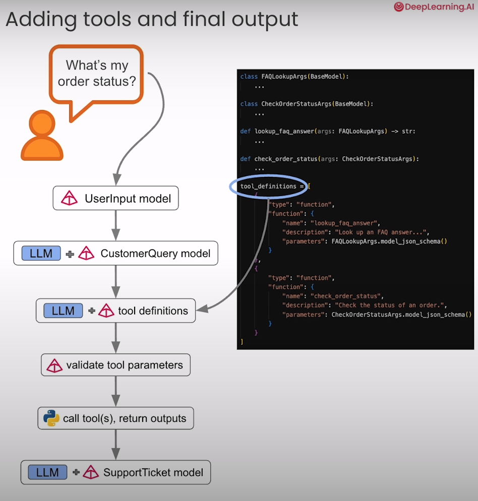

# 🚀 Advanced LLM Applications  
*From Validation to APIs & Tools*  

Large Language Models (LLMs) are powerful — but raw usage isn’t enough.  
To make them **robust, structured, and practically useful**, we need the right techniques.  

👉 **This repo demonstrates exactly that.**  

Through interactive notebooks, you’ll learn:  
- **Validating outputs** for safety & correctness  
- **Structuring responses** with Pydantic models  
- **Calling external tools/APIs** dynamically

---

## 📚 Table of Contents
- [🧠 Introduction](#-introduction)  
- [🧱 Why These Techniques Matter](#-why-these-techniques-matter)  
- [🛠️ Notebook Walkthrough](#️-notebook-walkthrough)  
  - [✔️ Validating LLM Responses](#️-validating-llm-responses)  
  - [📦 Pydantic Models in API Calls](#-pydantic-models-in-api-calls)  
  - [🔧 Tool Calling](#-tool-calling)  
- [🎨 Final Thoughts](#-final-thoughts)  
- [📦 Resources](#-resources)  
- [👥 Owner](#-owner)  
- [📄 License](#-license)  

---

## 🧠 Introduction
This repo showcases **practical methods** to go beyond “chatting” with an LLM.  

✔️ How to validate model outputs  
✔️ How to enforce schema constraints with Pydantic  
✔️ How to extend models with tool-calling  

---

## 🧱 Why These Techniques Matter
Pre-trained LLMs generate fluent text but lack guarantees.  

❌ Without validation, they may hallucinate or produce broken JSON  
❌ Without structure, APIs can’t rely on responses  
❌ Without tools, they’re limited to text-only answers  

✅ With validation, structured outputs, and tools:  
- **Reliable APIs** can be built  
- **Automation** becomes possible  
- **Real-world use cases** (finance, healthcare, coding) become safer  

---

## 🛠️ Notebook Walkthrough  

### ✔️ Validating LLM Responses  
Learn how to:  
- Check correctness of outputs  
- Enforce constraints (e.g., JSON schema)  
- Catch invalid generations  

**Best for:** developers who need *trustworthy outputs*.  

---

### 📦 Pydantic Models in API Calls  
Explore how to:  
- Pass structured schemas in prompts  
- Automatically parse responses into Python objects  
- Simplify downstream usage in apps  

**Best for:** API builders & data engineers.  

---

### 🔧 Tool Calling  
Discover how LLMs can:  
- Dynamically call external APIs  
- Trigger functions with structured arguments  
- Act as “agents” connecting knowledge + actions  

**Best for:** building assistants & automation pipelines.  

---

## 🎨 Final Thoughts  
These techniques form the **toolkit for production-ready LLMs**:  
- Validation ensures **safety**  
- Pydantic ensures **structure**  
- Tool calling ensures **power**  

📊 **Summary**  

| Technique     | Purpose                     | Best For             |
|----------------|-----------------------------|-----------------------|
| Validation     | Catch incorrect outputs     | Reliability          |
| Pydantic       | Enforce schema & structure  | APIs, pipelines      |
| Tool Calling   | Extend abilities beyond text| Agents, automation   |

---

## 📦 Resources  
- 📓 Hands-on notebooks included (`01`, `02`, `03`)  
- 🔗 [Pydantic Docs](https://docs.pydantic.dev/)  
- 🔗 [OpenAI Function Calling](https://platform.openai.com/docs/guides/function-calling)  
- 🔗 [Pydantic for LLM Workflows — DeepLearning.AI Course](https://learn.deeplearning.ai/courses/pydantic-for-llm-workflows/lesson/w6ohb/welcome-to-pydantic-for-llm-workflows)  

---

## 👥 Owner  
Repo maintained by: **DeepLearning.AI**

---

